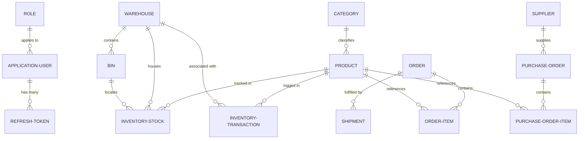
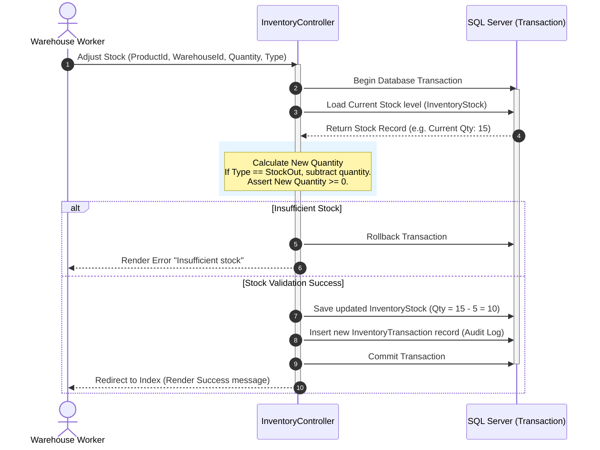

# Warehouse & Supply Chain Management System
## System Documentation & Architecture Guide

Welcome to the comprehensive technical documentation for the **Supply Chain & Warehouse Management System (WMS)**. This guide outlines the project's purpose, capabilities, technology stack, directory structure, system architecture, database design, and setup instructions.

---

## 1. Executive Summary: Why this Project was Created

The project was created to serve as an enterprise-grade skeleton/template for a **Supply Chain & Warehouse Management System (WMS)** built on **.NET 8** using **Clean Architecture** and **CQRS (Command Query Responsibility Segregation)**. 

### Real-World Business Drivers
In modern supply chains, businesses struggle with fragmented data, lack of inventory traceability, and inefficient fulfillment loops. This project provides a robust solution designed to address:
- **Inventory Visibility:** Knowing exactly where products are located down to the specific warehouse and storage bin level.
- **Traceability & Audit Trails:** Logging every stock adjustment (inputs, outputs, transfers) to verify compliance, analyze losses, and prevent fraud.
- **Order and Procurement Flows:** Coordinating inbound deliveries (Purchase Orders) from suppliers and outbound shipments (Sales Orders) to clients.
- **Operational Security:** Preventing unauthorized operations by dividing responsibilities among distinct operational roles (Admin, Manager, Worker, Viewer).
- **Scalability & Clean Code:** Serving as a reference architecture for developing enterprise .NET applications that are easily testable, decoupled, and maintainable.

---

## 2. System Capabilities: What It Can Do

The system implements the core operational pillars of supply chain management:

### 📊 Role-Based Dashboards
- **Customized UI Views:** Provides tailored dashboards for four distinct user roles: **Admin**, **Manager**, **Worker**, and **Viewer**.
- **Real-Time Key Metrics:** Highlights critical metrics such as:
  - Total products, categories, warehouses, and suppliers.
  - Active orders count and shipment status.
  - Total financial value of all stock in the inventory.
- **Operational Alerts:** Displays low-stock notifications (items with quantity < 10) to initiate reorder processes.
- **Activity Stream:** Renders the most recent inventory transactions and customer orders.

### 📦 Catalog Management
- **Product Registry:** Maintains complete product profiles (Name, SKU, Description, Unit Price).
- **Category Hierarchy:** Organizes items into categories for structured filtering and reporting.
- **SKU Uniqueness Validation:** Enforces database-level and application-level uniqueness constraints on Stock Keeping Units (SKUs).

### 🏢 Warehouse & Bin Management
- **Multi-Warehouse Support:** Tracks inventory across multiple physical facilities.
- **Bin-Level Precision:** Sub-divides warehouses into specific storage zones (Bins) with composite indices (Bin code unique per warehouse) to support advanced picking and packing.

### 🔄 Stock Control & Adjustments
- **Stock Movement Log:** Provides interfaces for manual inventory adjustments:
  - **Stock In / Purchase Receive:** Restocking or receiving inventory.
  - **Stock Out / Order Dispatch:** Deducting stock due to sales or waste.
  - **Adjustment:** Re-counting and aligning stock figures.
  - **Transfer:** Moving stock from one facility/bin to another.
- **Constraint Safety:** Automatically blocks stock-out operations if current quantities are insufficient, preventing negative inventory states.

### 🧾 Procurement & Fulfillment (Scaffolded Entities)
- **Purchase Orders (Inbound):** Manages supplier orders and processes incoming product quantities.
- **Customer Orders (Outbound):** Manages buyer shipments, inventory reservations, and delivery confirmations.

---

## 3. Technology Stack

This project is built using modern, industry-standard enterprise frameworks:

| Category | Technology | Version | Purpose |
| :--- | :--- | :--- | :--- |
| **Runtime & SDK** | .NET 8 (C# 12) | `net8.0` | Core execution environment and modern language features. |
| **Web Presentation** | ASP.NET Core MVC | `8.0.0` | Server-rendered UI using Razor pages and layout templates. |
| **Hot Reload** | Razor Runtime Compilation | `8.0.0` | Speeds up UI development by applying Razor changes without rebuilding. |
| **ORM / Data Access** | Entity Framework Core | `8.0.0` | Code-First database mapping, change tracking, and migrations. |
| **Database Engine** | Microsoft SQL Server | LocalDB / Server | Relational database storage with transaction support. |
| **Mediator Pattern** | MediatR | `11.1.0` | De-couples controllers from business logic; dispatches commands and queries. |
| **Authentication** | ASP.NET Core Identity | `8.0.0` | Handles membership databases, password hashing, and user sessions. |
| **API Token Security** | JWT Bearer Authentication | `8.0.0` | Secures REST endpoints using JSON Web Tokens (Access + Refresh). |
| **Validation Engine** | FluentValidation | `11.3.1` | Strongly typed validation rules separated from domain model definitions. |
| **Data Mapping** | AutoMapper | `12.0.0` | Automatically maps Entities to DTOs and ViewModels to Commands. |
| **Structured Logging** | Serilog | `7.0.0` | Outputs rich JSON logs to both Console and daily rolling file sinks. |
| **Interactive Docs** | Swashbuckle (Swagger) | `6.6.1` | Renders a visual API playground for developers at `/swagger`. |

---

## 4. Architectural Design Patterns

This system applies several enterprise design patterns to maintain high code quality and testability:

```
                  +-----------------------------------------+
                  |            Presentation Layer           |
                  |     (MVC Controllers / Razor Views)     |
                  +-----------------------------------------+
                                       |
                                       | Sends IRequest<T>
                                       v
                  +-----------------------------------------+
                  |            Application Layer            |
                  |     (MediatR Commands, Queries, DTOs)   |
                  +-----------------------------------------+
                                       |
                                       | Calls Services/Handlers
                                       v
                  +-----------------------------------------+
                  |         Infrastructure & Domain         |
                  |  (EF Core DbContext, Repositories, UoW)  |
                  +-----------------------------------------+
                                       |
                                       | SqlClient
                                       v
                  +-----------------------------------------+
                  |             Microsoft SQL Server        |
                  +-----------------------------------------+
```

### A. Clean Architecture Boundaries
- **Domain Layer:** Contains raw database models (Entities) and business enums. Dependencies are zero.
- **Application Layer (CQRS):** Command/Query definitions, handlers, DTOs, and mapping rules. It only references domain entities and repository interfaces.
- **Infrastructure Layer:** Concrete database access implementations, Entity Framework DbContext, third-party authentication services, and logging.
- **Presentation Layer (MVC):** Lightweight controllers that forward user input directly to MediatR via `IMediator.Send()`, entirely bypassing database logic.

### B. CQRS (Command Query Responsibility Segregation) via MediatR
- **Commands (Write Actions):** Classes implementing `IRequest<BaseResponse<T>>` representing intent to modify data (e.g., `CreateProductCommand`). Handled by dedicated Command Handlers.
- **Queries (Read Actions):** Classes representing requests to fetch data without side effects (e.g., `GetAllProductsQuery`). Returns DTOs to keep entities decoupled from view models.
- **Benefits:** Optimizes security, isolates read and write operations, and simplifies testing since handlers only depend on specific data repositories.

### C. Generic Repository & Unit of Work (UoW)
- `IGenericRepository<T>` and `IRepository<T>` abstract EF Core commands (`DbSet<T>`).
- `IUnitOfWorkAsync` handles EF Core transaction scopes (`BeginTransactionAsync`, `CommitAsync`, `RollbackAsync`). This guarantees that multi-stage writes (e.g., adjusting stock levels *and* appending to transaction history) either succeed together or roll back completely.

### D. Automatic Auditing & Soft Delete
To prevent accidental data loss and trace history, `ApplicationDbContext` overrides `SaveChanges` to run automated logic:
- **Timestamps:** Automatically populates `CreatedAt` (on Add) and `UpdatedAt` (on Update) properties for entities derived from `BaseEntity`.
- **Soft Delete:** Intercepts deletions, marks `IsDeleted = true` instead, and switches the EF state to `Modified`.
- **Global Query Filters:** Automatically appends `.Where(e => !e.IsDeleted)` to all select queries behind the scenes, ensuring deleted products and warehouses are hidden by default unless explicitly retrieved.

---

## 5. System Entity Relationships (ERD)

The core supply chain entities are structured as follows:



### Entity Explanations
1. **Category & Product:** Catalog schema defining product parameters.
2. **Warehouse, Bin, & InventoryStock:** Tracks current quantities. A product can reside in multiple warehouses, and inside a warehouse, it can reside in specific bins.
3. **InventoryTransaction:** Ledger database mapping additions and subtractions.
4. **Supplier & PurchaseOrder:** Procurement flow representing incoming inventory logistics.
5. **Order, OrderItem, & Shipment:** Fulfillment flow representing client requests, quantities, and tracking.

---

## 6. Directory Structure Map

Below is a breakdown of where components live inside the workspace:

```
warehouse/
│
├── Controllers/            # UI Controllers routing HTTP requests to MediatR handlers
│   ├── Admin/              # Administrative routing logic
│   ├── Auth/               # Access controls (Login, Logout, JWT Token issuance)
│   └── Products/Categories # Operations for catalog administration
│
├── Models/                 # System Data Carrier models
│   ├── Entities/           # Database Domain entities (Product.cs, WarehouseEntity.cs...)
│   ├── DTOs/               # Data Transfer Objects used to return data from queries
│   ├── ViewModels/         # UI-bound schemas tailored for Razor rendering
│   └── Enums/              # Operational flags (OrderStatus, ShipmentStatus...)
│
├── CQRS/                   # MediatR CQRS definitions
│   ├── Commands/           # Request payloads containing arguments to modify data
│   ├── Queries/            # Request payloads representing data fetch requests
│   └── Handlers/           # Command & Query logic executing business rules
│
├── Data/                   # Data access configuration & initializers
│   ├── Configurations/     # Fluent API configurations for DbContext schema mapping
│   ├── Seeders/            # Database initialization routines
│   ├── Migrations/         # EF Core migrations tracking schema changes
│   └── ApplicationDbContext.cs # Database connection manager & SaveChanges interceptor
│
├── Repositories/           # Data layer abstraction layer
│   ├── Interfaces/         # generic repository & Unit of Work signatures
│   └── Implementations/    # Concrete EF Core repository providers
│
├── Services/               # Domain-specific utility services
│   ├── Interfaces/         # Interface signatures for authentication and JWT
│   └── Implementations/    # Auth logic and token generation algorithms
│
├── Middleware/             # Global HTTP pipeline hooks (Exceptions, Authorization)
├── Validators/             # FluentValidation scripts validating commands and ViewModels
├── Mapping/                # AutoMapper mapping configurations
├── wwwroot/                # CSS, bootstrap, client JS, and assets
├── Views/                  # Razor templates (.cshtml pages) mapped to controllers
└── Program.cs              # DI container setup, middleware configuration, and app initialization
```

---

## 7. Execution Workflows

### A. stock adjustment workflow
The diagram below details the end-to-end execution flow of a stock adjustment action:



---

## 8. Setup & Execution Instructions

Follow these instructions to run the project in your local development environment:

### 1. Prerequisites
- Install **.NET 8 SDK**
- Install a running **SQL Server** instance (SQL Express, LocalDB, or Developer Edition)
- Optional: **Visual Studio 2022** or **VS Code** with C# Dev Kit extensions.

### 2. Configure Database Connections
Open `appsettings.json` and configure:
- Your SQL database connection string in `ConnectionStrings:DefaultConnection`.
- A secure cryptographic secret key in `JwtSettings:Secret` (minimum 32 characters for JWT signature).

```json
{
  "ConnectionStrings": {
    "DefaultConnection": "Server=(localdb)\\mssqllocaldb;Database=WarehouseDb;Trusted_Connection=True;MultipleActiveResultSets=true"
  },
  "JwtSettings": {
    "Issuer": "WarehouseIssuer",
    "Audience": "WarehouseAudience",
    "Secret": "A_Secure_And_Super_Long_Secret_Key_At_Least_32_Bytes_Long",
    "AccessTokenExpirationMinutes": "15"
  }
}
```

### 3. Apply EF Migrations
Open your terminal inside the project root directory and execute:

```bash
# 1. Restore NuGet dependencies
dotnet restore

# 2. Build project assemblies
dotnet build

# 3. Apply database migrations
dotnet ef database update
```

### 4. Run the Project
Start the development server using the CLI:

```bash
dotnet run
```

Alternatively, open `warehouse.slnx` or `warehouse.csproj` in Visual Studio and click **Run / Start Debugging (F5)**.
- Access the Web interface at: `https://localhost:7196` (or the dynamic port printed to the console).
- View API documentation at: `https://localhost:7196/swagger` (only APIs marked with `[ApiController]` are exposed here).

### 5. Seeding & Authentication (Development)
The system automatically executes `RoleAndUserSeeder.cs` upon initial startup to establish standard access accounts. Use these credentials to sign in during development:

- **Username / Email:** `admin@warehouse.local`
- **Password:** `Admin@12345`

> [!WARNING]  
> The seeded administrator profile is configured with a weak, publicly known password for development convenience. **Change the password immediately** in a staging/production database or configure custom production seeders.

---

## 9. Future Scalability Plan & Improvements

For large-scale, high-concurrency production deployments, the system is designed to scale using these architectural paths:

1. **Database Segregation:** Read operations (Queries) can be routed to a read-replica database to isolate them from transactional locking during write operations (Commands).
2. **Caching Layer:** Add distributed caching (such as **Redis**) inside MediatR Query Handlers to serve frequent read-only lists (like Product catalogs or Categories) instantly.
3. **Decoupled Background Tasks:** Offload heavy asynchronous tasks (e.g., preparing packing lists, sending delivery notification emails, or computing end-of-month stock summaries) to separate worker processes using Message Brokers like **RabbitMQ** or **Azure Service Bus**.
4. **Token Security Hardening:** Implement refresh token rotation (invalidating previous tokens if a refresh token is reused) to protect against token hijacking.
